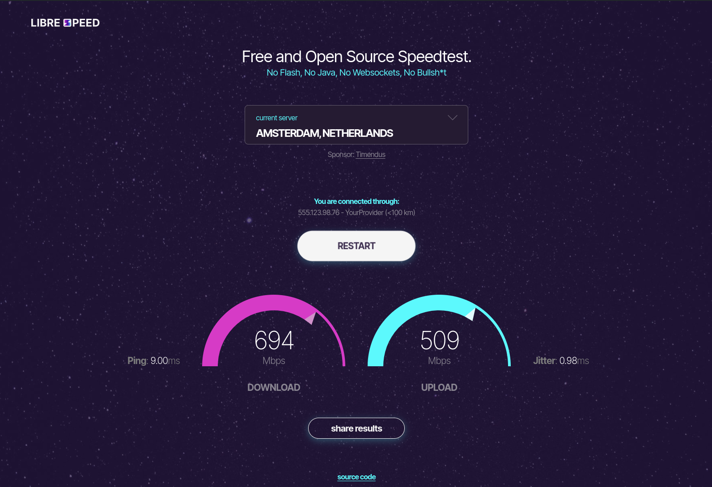
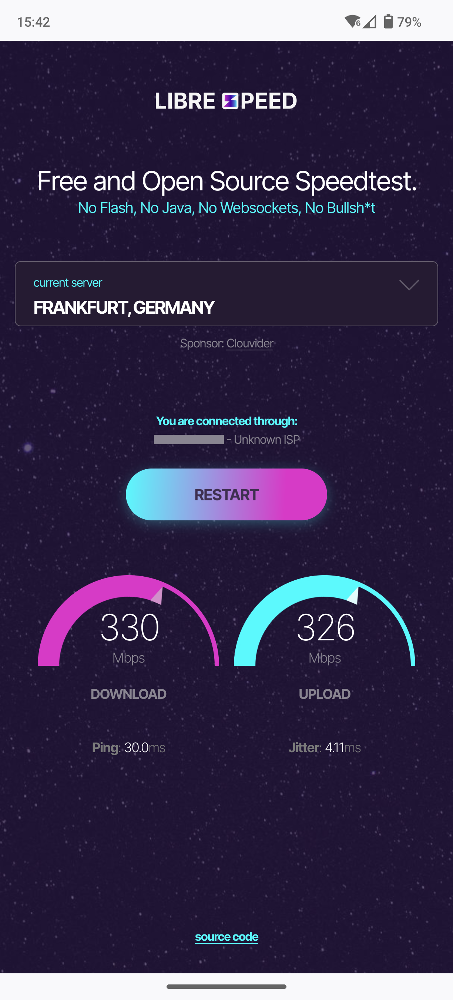

# LibreSpeed frontend

This is a re-implementation of the LibreSpeed user interface based on [the
design by fromScratch](https://github.com/librespeed/speedtest/issues/585). The
code that's doing the actual speed test is still the same.

### Desktop

### Mobile

## How to use

Copy everything in this directory into the LibreSpeed root, next to
`speedtest.js` and `speedtest_worker.js`, overwriting the `index.html` file that
may already be there. That's it!

## Configuration

In the [`server-list.json`](./server-list.json) file you can provide a list of
testing servers. If you only have a single testing server, just provide a list
with one item in it, being your server. The frontend will then skip doing an
automatic server selection and will not allow the user to change servers.

For more advanced applications, you can override any of the settings that are
defined in `speedtest_worker.js` using the file
[`settings.json`](./settings.json). See
[`speedtest_worker.js`](../speedtest_worker.js) for documentation on the
different settings (scroll down a bit to where you find the definition of the
`settings` object).

## Features

- Shows upload and download speed and progress
- Shows ping and jitter
- Shows your IP address and internet service provider if the testing server
  supports it
- Can handle a single testing server or a list of servers
- Can save telemetry and share results if the hosting server supports it (set
  `telemetry_level` in [`settings.json`](./settings.json))
- Does not require any build steps; implementation is pure JS & CSS
- Has zero dependencies

## Limitations

- This frontend relies heavily on modern browser features. It should work very
  well in all modern ("evergreen") browsers, but has **no** backwards compatibility
  with older browsers.

## Credits

**Design** by fromScratch Studio - 2022, 2023
([www.fromscratch.io](https://www.fromscratch.io))

> "During Hacktoberfest 2022 & 2023, fromScratch Studio took on the request for
> LibreSpeed redesign and UI improvements. We ran 2 design sprints one on '22 and
> one on '23, and produced high-fidelity screens for LibreSpeed redesign.
> Furthermore, this year, we produced high-fidelity screens for mobile-view as
> well."

_-- Chris-ZoGo, https://github.com/librespeed/speedtest/issues/585_

**Implementation** by Timendus - 2024
([https://github.com/Timendus](https://github.com/Timendus))

> "I had a couple of days of free time, and I came across the design by
> fromScratch. I thought it looked great, and that it deserved a good
> implementation, so I set out to make one. I've taken the liberty of changing a
> couple of details, coming up with some animations and adding a few small
> features, but otherwise I've tried to stay as close to the "intention" of the
> design as I could."

_-- Timendus, https://github.com/librespeed/speedtest/pull/649_
